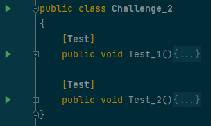

# Code Puzzles!

Each file named `Challenge_X.cs` - [Challenge_1.cs](Challenge_1.cs), [Challenge_2.cs](Challenge_2.cs), etc. - contains a
puzzle.

Instructions on how to complete the test will be located in comments at the top of the challenge class.


Each puzzle is checked using **tests**, which are special methods that say `[Test]` at the top of them:

```csharp
[Test]
public void CheckAnswer(){
    Assert.That(2 + 2, Is.EqualTo(4));
}
```

To execute a single test, click on the green ▶ button to the left of the test method's name.

To execute **all** of the tests for a challenge, click on the green ▶ button to the left of the **challenge class's
name**.

